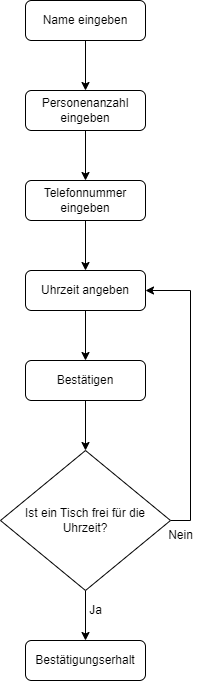

# Inhalt
- [Problembeschreibung](#problembeschreibung)
- [Betrieb](#betrieb)
- [Benutzung](#benutzung)
- [Architektur](#architektur)
- [Ungelöste Probleme](#probleme)

# Problembeschreibung
Da es bei Restaurants immer hektisch zu geht, sollte das Online-Reservierungs-Tool den Mitarbeitern die Arbeit erleichtern. Konsumenten erwarten auch in der heutigen Zeit digitale Lösungen, um das Reservieren effizienter zu machen. Das Projekt speichert neue Reservierungen in Übereinstimmung mit den bereits existierenden Reservierungen ohne dass ein Mitarbeiter die Kapazität kontrollieren muss.

# Betrieb
Für den Betrieb müssen keine zusätzliche Pakete heruntergeladen werden. Um die Applikation zu starten, muss main.py ausgeführt werden.

# Benutzung
Auf der Startseite kann man direkt das Formular für eine Tischreservierung ausfüllen. Wenn die Eingabe ungültig ist, kommt eine Fehlermeldung. Bei gültiger Eingabe wird die Reservierung bestätigt.

# Architektur

# Ungelöste Probleme
Konnte die Fehlermeldung "KeyError: 'Datum'" nicht lösen. Web-Applikation funktioniert daher nicht richtig.
Es könnte eine Menükarte hinzugefügt werden, damit Gäste im vorhinein schon sehen können was das Restaurant anbietet.